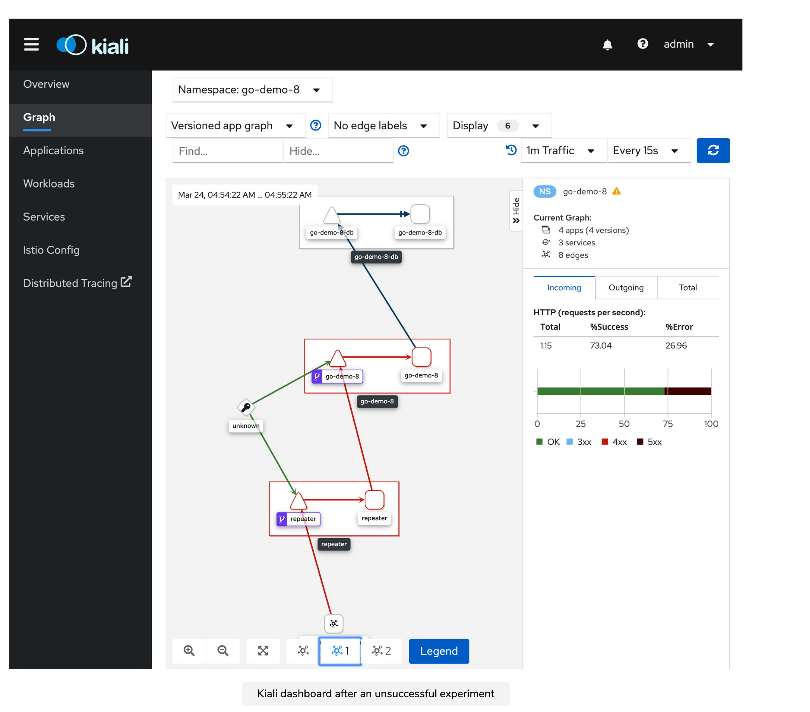

## "How to perform Random Chaos and Observe?" 

Previously, experiments were being with high determinism. To be more close to the real scenarios we can randomize the experiments. We’ll randomize the targets by making them independent of specific applications. To do that, we need to rethink how we validate the results of such experiments. Steady-state hypotheses in Chaos Toolkit will not get us there. It is assumed that we know in advance what to measure and what the desired state is, both before and after the experiments. If, for example, we go crazy and start removing random nodes, we won’t be able to define the state of the whole cluster or the entire Namespace in advance. Or, at least, we won’t be able to do that in Chaos Toolkit format. 

### Prerequisites

For running this experiment, as expected we need a cluster. Since we know the advantages of multi-zonal clusters we can use those
(described in cluster setup wiki) or we can use any cluster for test and trial.

### Application Setup

Once you have the prerequisites in place you can deploy the `before` conditions
of the application as follows:

```shell
$ kubectl create ns go-app
$ kubectl label namespace go-app istio-injection=enabled
$ kubectl --namespace go-app apply --filename k8s/app-full
$ kubectl --namespace go-app rollout status deployment go-app
``` 
<br>

Sending a request to confirm accessibility:
```shell
curl -H "Host: repeater.acme.com" "http://$INGRESS_HOST?addr=http://go-app"
```
<br>

Also, What we need is a proper monitoring and alerting system that will allow us to observe the cluster as a whole and (potentially) get alerts when something goes wrong in any part of the system. With proper monitoring, dashboards, and alerting in place, we can start doing random destruction and catch many (if not all) anomalies in the system. Checkout Observability wiki to know generic setup instructions. But before we do any of those things, we need to generate some traffic in our cluster that will create observable metrics. Otherwise, if our cluster is dormant and nothing is happening inside, we would not be able to see those metrics in action and explore monitoring and alerting.

One can use [hey](https://formulae.brew.sh/formula/hey) for simulation traffic using multiple requesters if aws, gcp or any other cloud provider is being used. `hey -c 2 -z 200s http://$INGRESS_HOST?addr=http://go-app/demo/person`.<br>
If using local setup, it is simpler to use Curl `while true; do curl -i -H "Host: repeater.acme.com" "http://$INGRESS_HOST?addr=http://go-app/demo/person" sleep 1 done`.

### Defining configuration in Kubernetes using the ConfigMap

For running chaos experiments inside the Kubernetes cluster, below two steps are required:<br>
1. Experiment definitions are to be stored somewhere in the cluster. The most common and the most logical way to define a configuration in Kubernetes is to use ConfigMap.<br>
1. Apart from having experiment definitions readily available, a ServiceAccount is needed to add the necessary privileges to processes that will run the experiments.

Experiment is defined as [ConfigMaps](./experiments-any-pod.yaml) in this, we attempt to randomly terminate pod in go-app namespace, and permissioned using [Service Account](./sa-cluster.yaml).

```shell
$ kubectl create namespace chaos
$ kubectl --namespace chaos apply --filename experiments-any-pod.yaml
$ kubectl --namespace chaos apply --filename sa-cluster.yaml
```

**Note:** Service Account allows almost all actions, but limited to a specific Namespace.<br>
To be safe, it needs to be more restrictive than that. Permissions will effectively allow processes in that Namespace to do anything inside it. On the other hand, it is tough to be restrictive with permissions which are needed for chaos experiments. Theoretically, one might want to affect anything inside a Namespace or even the whole cluster through experiments. So, no matter how strong our desire is to be restrictive with the permissions in general, one might need to be generous to chaos experiments. For them to work correctly, one needs to likely allow a wide range of permissions. As a minimum, one can permit to perform the actions planned to be run.


### Running Periodic Experiment

We can also run experiments periodically. We might choose to do chaos every few minutes, every few hours, once a day, or whatever the schedule we’ll define is.


```shell
$ kubectl -n go-app apply --filename periodic.yaml
```

<br>

The cronjob will be scheduled to run every two minutes.
Observe the cronjobs, jobs, pod jobs (may take some time to be scheduled) till you have `completed` which implies success or `error` which implies failed. Do not forget to `delete` the cronjob after.

```shell
kubectl --namespace chaos get cronjobs
NAME                    SCHEDULE    SUSPEND ACTIVE LAST SCHEDULE AGE
health-instances-chaos */2 * * * *  False   1      8s            107s

kubectl --namespace chaos get jobs
NAME                        COMPLETIONS DURATION AGE
health-instances-chaos-...  1/1         93s      98s


kubectl --namespace chaos get pods
NAME                       READY STATUS    RESTARTS AGE
health-instances-chaos-... 0/1   Completed 0        107s

```
<br>

We configured Jobs not to restart on failure. That’s what we’re doing in that definition by `setting spec.template.spec.restartPolicy` to Never. Experiments can be successful or failed, and no matter the outcome of an experiment, the Pod created by that Job will run only once. Also, here only one container is defined. We could have more if we’d like to run multiple experiments.

<br>

### Inspecting Grafana & Kiali

Use `istioctl dashboard grafana` for opening grafana dashboard and visit Istio Mesh dashboard for fine-grained details on services. Similarly, use `istioctl dashboard kiali` for opening kiali dashboard and visit Service Graph for fine-grained details on services.

<br>



<br>

**Observation:** We can see that the traffic is blocked. External traffic goes to the repeater. From there, it goes to go-app, and then it fails to reach the database. The problem might be that database was destroyed.
Here, database is not replicated. It makes sense that one of the experiments eventually terminated the database. That could result in the crash of all the applications that, directly or indirectly, depend on it. Destroying a Pod of the repeater is okay because there are two replicas of it. The same can be said for go-app as well. But the database, with the current setup, is not highly available. We could predict that destroying the only Pod of the DB results in downtime. Similarly in grafana, success rate for these services in Istio Mesh dashboard can be observed to be 0%.

<br>

Even though all pods might be available after experiment, above observation can be observed. Thus, a restart can work in this case.

```shell
kubectl --namespace chaos delete --filename periodic.yaml
kubectl --namespace go-app rollout restart deployment go-app
```

**Learning:** In such scenario code of the application must have code to restabilish connection. Thus, it is a design flaw of the application that it does not have a condition to retry 
the connection establish operation. So, even if we would make the database fault-tolerant and even if Kubernetes would recreate failed replicas of the database, the damage is permanent due to bad code. We would need to re-design the application to make sure that when the connection to the database is lost, the app itself tries to re-establish it.
Even better, we could make the application fail when the connection to the database is lost. That would result in the termination of the container where it’s running, and Kubernetes would recreate it. That process might repeat itself a few times. However, once the database is up-and-running again, the container’s restart would result in a new boot of the application, which would be able to re-establish the connection. Otherwise, we can opt for a third solution.<br>
We could also change the health check. Right now, the address is not targeting an endpoint that uses the database. As a result, the health check seems to be working fine, and Kubernetes sees no reason to terminate containers of go-app.
